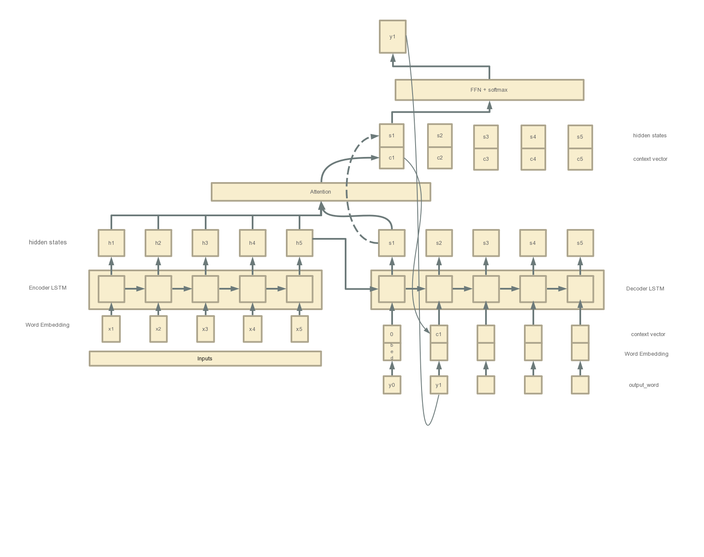

# seq2seq attention 机制详解
## 1.seq2seq 模型公式
$$P(y_i|y_1,...,y_{i-1},X) = g(y_{i-1},s_{i},c_{i})\tag{1-1}$$
$$s_i = f(s_{i-1},y_{i-1},c_i)\tag{1-2}$$
$$c_i = \sum_{j=1}^{T_x}\alpha_{ij}h_j\tag{1-3}$$
$$\alpha_{ij} = \frac{exp(e_{ij})}{\sum_{k=1}^{T_x}exp(e_ik)}\tag{1-4}$$
$$e_{ij} = a(s_{i-1},h_j)\tag{1-5}$$

&emsp;&emsp;从公式(1-1)可以看出$y_i$和context 向量$c_i$,上一时刻的hidden state $s_i$向量 和输出向量$y_{i-1}$相关。  
&emsp;&emsp;从公式(1-2)可以看出$s_i$ 和context 向量$c_i$,上一时刻的hidden state $s_{i-1}$向量 和输出向量$y_{i-1}$相关。  
&emsp;&emsp;上一时刻的向量$s_{i-1},y_{i-1}$是已知的，接下来就是计算$c_i$,其实$c_i$就是source hidden states 的一个加权平均向量，要计算的就是对每个source hidden state的权重系数$\alpha_{ij}$，含义是decode阶段的i时刻对encode阶段的第j个时刻的hidden state 的系数。  
&emsp;&emsp;从(1-4)可以看出就是一个softmax函数，就是保证系数加权后为1，因此主要就是需要计算$e_{ij}$。  
&emsp;&emsp;那么如何计算$e_{ij}$,目前已知的向量只有$s_{i-1}和y_{i-1}$,很显然$y_{i-1}$无法利用，能利用的就只有$s_{i-1}$,因此可以通过公式(1-5)可以看出$e_{ij}$的定义，与decoder 的i-1时刻的hidden state $s_{i-1}$ 和encoder 阶段的j时刻的隐藏向量$h_j$相关。  
&emsp;&emsp;**参考文献[NEURAL MACHINE TRANSLATION
BY JOINTLY LEARNING TO ALIGN AND TRANSLATE](https://arxiv.org/pdf/1409.0473.pdf)**
## 2.effective Approaches 
&emsp;&emsp;在seq2seq的模型中，encoder 和decoder 采用的都是rnn单元，rnn单元含有隐藏层状态，其中不采用attention机制的情况下，预测$y_i$就是将隐藏层状态$s_i$进行投影，即$y_i = softmax(s_i w + b)$。  
&emsp;&emsp;采用attention机制后修改计算$y_i$的方法。由于decoder采用的是rnn的方式，因此 i 时刻的rnn隐藏层向量$s_i$可以计算，同时假设i时刻的context全局向量$c_i$已知，那么可以计算t时刻新的隐藏层向量(就是计算$y_i$的输入向量)，如公式(2-1),然后通过t时刻新的隐藏层向量计算$y_i$,如公式(2-2)。
$$s_i^{new} = tanh(W_c[c_i;s_i])\tag{2-1}$$
$$p(y_i|y_{<i},x) = softmax(W_ss_i^{new})\tag{2-2}$$
### 如何计算$c_i$
&emsp;&emsp;在i时刻，decoder阶段的rnn隐藏向量$s_i$是已知的，同时encoder阶段的各个时刻的hidden state vector $h$ 是已知的。想要计算decoder阶段的i时刻对encoder阶段的j时刻隐藏向量$h_j$的attention系数，首先需要计算decoder阶段i时刻对encoder阶段的所有隐藏向量的一个分数score,然后softmax计算score即可得到attention 系数$\alpha_{ij}$，计算公式如(2-3):  
$$\alpha_{ij} = align(s_i,h_j) = \frac{exp(score(s_i,h_j))}{\sum_jexp(score(s_i,h_j))}\tag{2-3}$$  
&emsp;&emsp;计算score有三种方式：dot、general、concat,在工程中大多数用的是general方式，如公式(2-4)
$$score(s_i,h_j) = s_i^TW_ah_j\tag{2-4}$$
&emsp;&emsp;**参考文献[Effective Approaches to Attention-based Neural Machine Translation](https://arxiv.org/pdf/1508.04025v3.pdf)**
## 3.工程实现
&emsp;&emsp;上一节很好的讲述啦如何将rnn和attention机制结合，接下来介绍在工程中的实现方法。  
&emsp;&emsp;为了与上一节进行对应，字母符号统计处理成一致的。首先需要计算$e_{ij}$即decoder i 时刻与encoder j时刻的隐藏向量得分，如(3-1):  
$$e_{ij} = score(s_i,h_j) = v^Ttanh(W_1s_i + W_2h_j)\tag{3-1}$$
&emsp;&emsp;计算出$e_{ij}$后，通过softmax即可计算$\alpha_{ij}$,进而求出$c_i$,之后的计算过程和第2小节一致。  
&emsp;&emsp;其中$v^T,W_1,W_2$是需要学习的参数
&emsp;&emsp;**参考文献[Grammar as a Foreign Language](https://papers.nips.cc/paper/5635-grammar-as-a-foreign-language.pdf)**
## 4.图解
&emsp;&emsp;果然还是总结自己写才有意义，别人写的都是别人的理解，自己写的才是自己对问题的理解，为了更清楚的了解过程，图解如下：  
